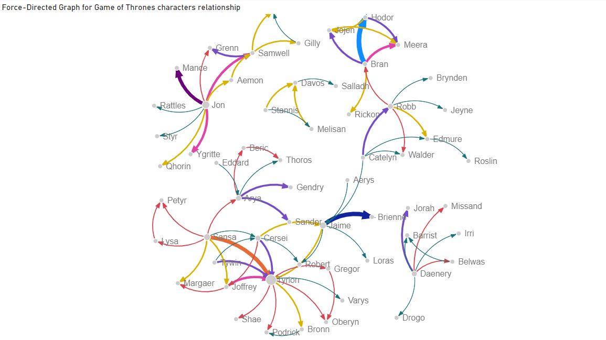

## Visualización de datos

## PEC 2

### GRUPO I (Técnicas básicas i populares): 105. Area Chart

**Descripción**: Un gráfico de área muestra la evolución de una variable continua a lo largo del tiempo. Se pueden dividir en categorías y mostrar como stacked area chart. El color del área permite diferenciar fácilmente entre categorías (datos cuantitativos). En un área chart se puede ver fácilmente la evolución a lo largo del tiempo de cada categoría mientras que en un stacked area chart vemos las diferencias entre las diferentes categorías y la suma del total de las categorías.

**Ejemplo**: Visualizar la evolución de diferentes fuentes de consumo de energía mundial a lo largo de los años.

**Tipo de datos y estructura**: Datos numéricos continuos históricos que pueden estar divididos en diversas categorías.

**Limitaciones**: Puede dificultar la lectura cuando hay múltiples áreas que se superponen y si los colores no son fáciles de diferenciar entre ellos.

**Representación**: Esta representación permite ver la evolución del consumo de energía mundial de diferentes fuentes de energía. Podemos responder a preguntas como cuál es la fuente que más se consume o la que ha tenido mayores cambios a lo largo del tiempo. Con estos datos y visualización podemos lograr responder a estas preguntas y afirmar que la energía fósil es la más utilizada porque el área es mayor. En cambio, la que más ha incrementado su consumo a lo largo del tiempo es la del gas porque es la que más ha incrementado el área debajo de la línea desde el año 1965 a 2023.

### GRUPO II (Habituales y conocidas en ámbitos específicos i de expertos): 204. Force-Directed Graph

**Descripción**: Muestra la relación entre entidades mediante un grafo. Los nodos representan las entidades y las aristas la relación entre los nodos.  Cuanto más gruesa es la línea que los conecta significa que mayor es la relación. En este tipo de visuales nos interesa como se distribuyen los nodos entre ellos, formando pequeñas comunidades y conexiones entre ellas.

**Ejemplo**: Representación de la relación de personajes de una película, donde las aristas indican el número de diálogos compartidos.

**Tipo de datos y estructura**: Los datos de los nodos deben ser cualitativos y categóricos, mientras que las relaciones entre nodos han de ser datos numéricos.

**Limitaciones**: Un exceso de conexiones puede saturar la visualización y dificultar la interpretación.

**Representación**: Este grafo pretende determinar qué personajes son los principales en la serie Juego de Tronos y ver qué relaciones son las más fuertes. Para ello hemos necesitado tener dos columnas de datos que muestran los personajes que están relacionados y una tercera que muestra el nivel de dicha relación. Podemos ver la gruesa línea entre los personajes Jaime & Brienne, Jon & Sam, Bran & Hodor, Daenerys & Sir Jorah. 

Para facilitar la visualización de la relaciones más fuertes podemos filtrar las relaciones mayores a cierto valor. En este caso al eliminar las relaciones menores a 15 vemos el siguiente resultado.

### GRUPO III (Menos habituales o más específicos): 302. Rain cloud Plots

**Descripción**: Un gráfico Rain Cloud combina un diagrama de violín, un gráfico de puntos y una caja de bigotes (box plot) para representar la distribución de datos continuos. Nos permite observar la distribución, la mediana y los valores individuales en una sola visualización.

**Ejemplo**: Comparar distribuciones de datos de diferentes grupos, como los tiempos de reacción de distintas edades en un estudio.

**Tipo de datos y estructura**: Datos continuos y segmentados en categorías para hacer comparaciones.

**Limitaciones**: Se han de tener conocimientos para entender un boxplot y puede ser confusa la combinación de diferentes elementos de visualización en un solo gráfico. Si se visualiza un gran conjunto de datos mostrar los puntos individuales puede saturar la visualización.

**Representación**: Este gráfico muestra la distribución del índice de masa corporal (BMI) de una población, clasificada en distintas categorías según su estado general de salud. También nos permite observar visualmente si ciertos estados de salud están asociados a características específicas del BMI. 

Cada categoría incluye medio diagrama de violín para ilustrar la densidad, junto con un diagrama de caja que muestra la mediana y el rango intercuartílico. Los puntos individuales de datos no se representan debido al gran volumen de información en esta visualización, lo que ayuda a evitar el solapamiento.

Observamos que las personas con un estado de salud excelente tienden a tener un BMI con menor media y menor variabilidad, por lo que sus rangos intercuartílicos también se encuentran en valores más bajos en comparación con el resto. En cambio, aquellas personas en peor estado de salud muestran una mayor variabilidad en sus datos, incluyendo colas que indican casos de BMI elevado.
Esta representación gráfica y el análisis de los datos son ideales para responder preguntas sobre la relación entre el BMI y el estado de salud de una población.

